<!-- CYBERPUNK VECTOR MORPHING BANNER -->

  <picture>
    <source media="(prefers-color-scheme: dark)" srcset="banner-dark.svg?v=5">
    <source media="(prefers-color-scheme: light)" srcset="banner-light.svg?v=5">
    
  </picture>

 

<!-- STREAK STATS CARD -->

  

 

<!-- LATE NIGHT DEBUGGING ANIMATION SECTION -->

  

 

<!-- CONTRIBUTION SNAKE ANIMATION -->

  <picture>
    <source media="(prefers-color-scheme: dark)" srcset="https://raw.githubusercontent.com/awaiss-3553/awaiss-3553/output/github-snake-dark.svg" />
    <source media="(prefers-color-scheme: light)" srcset="https://raw.githubusercontent.com/awaiss-3553/awaiss-3553/output/github-snake.svg" />
    
  </picture>

 

<!-- SOCIAL BADGES -->

  
  &nbsp;&nbsp;
  

